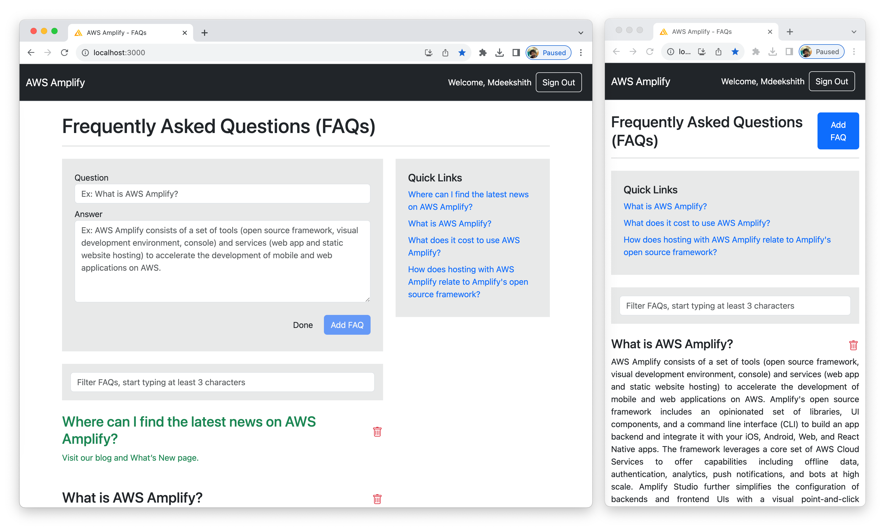

## Workshop: Building End-To-End Application using AWS Amplify and React

In this workshop you'll learn how to create a simple yet powerful full-stack web application using AWS Amplify, a comprehensive suite of tools and services that includes web hosting capabilities. Through this hands-on workshop, you will be guided step-by-step in building a functional web application that integrates authentication, a backend with APIs and a database, seamless frontend-backend connectivity, and ultimately, hosting the application.

During the workshop, you will leverage the following AWS Services and Tech Stack to construct your solution:

**AWS Services:**

- [AWS Amplify](https://docs.amplify.aws/): Streamlines the development process by providing a range of tools and services.
- [Amazon Cognito](https://aws.amazon.com/cognito/): Enables easy and secure user authentication and management.
- [AWS AppySync](https://aws.amazon.com/pm/appsync/): Simplifies building and deploying GraphQL APIs.
- [Amazon DynamoDB](https://aws.amazon.com/pm/dynamodb/): Offers a scalable and flexible NoSQL database service.
- [Amazon S3](https://aws.amazon.com/pm/serv-s3/): Provides secure object storage for various types of data.
- [Amazon CloudFront](https://aws.amazon.com/cloudfront/): Facilitates content delivery through a global content delivery network (CDN).

**Tech Stack:**

- [React](https://react.dev/): A popular JavaScript library for building user interfaces.
- [HTML 5](https://www.w3schools.com/html/): The latest version of Hypertext Markup Language.
- [CSS3](https://www.w3schools.com/css/): The latest version of Cascading Style Sheets.
- [JSX](https://react.dev/learn/writing-markup-with-jsx): A syntax extension for JavaScript, often used with React.
- [JavaScript](https://developer.mozilla.org/en-US/docs/Web/JavaScript): The programming language of the web.
- [GraphQL](https://graphql.org/): A query language for APIs that allows for efficient data fetching.
- [Bootstrap](https://getbootstrap.com/): A front-end framework for designing responsive and visually appealing web applications

**Key Application Features:**

- Sign-Up: Users can register and create accounts securely.
- Sign-In: Secure authentication mechanism for users to access the application.
- View Q&A: Users can browse through a list of questions and corresponding answers.
- Add Q&A: Users can contribute by submitting new questions and answers.
- Delete Q&A: The ability to remove unwanted questions and answers.
- Search Q&A: Users can easily search for specific questions within the existing collection.

By participating in this workshop, you will gain practical experience in building a functional full-stack web application using AWS Amplify and a variety of associated services. Whether you are new to web development or looking to enhance your skills, this workshop offers a valuable opportunity to expand your knowledge and capabilities in the realm of modern web application development. Don't miss out on the chance to learn and create with us!

Output: The below screenshot shows the FAQs Application.

---

Next: [Prerequisites >](prerequisites.md)
