# Set up fullstack project

#### Install Create React App Package

    npm i create-react-app

#### Create a new React App

    npx create-react-app aws-amplify-faqs
    cd aws-amplify-faqs
    npm start

To preview the running app:

- Open the **Preview** menu item from the top menu bar and select the **Preview Running Application** option, which launches the app in right panel.
- Click on **Pop Out Into New Window** to open in a browser tab.
  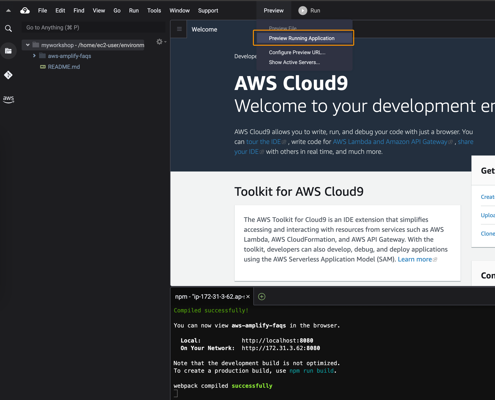
  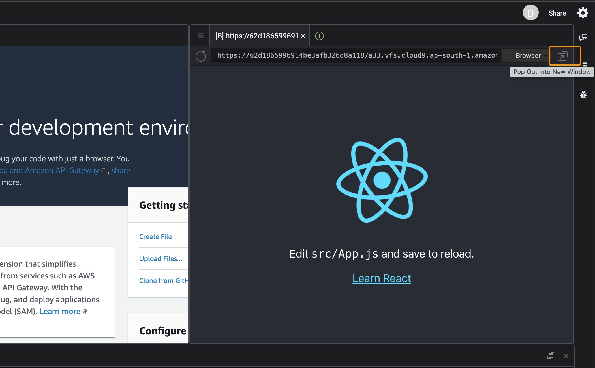

### Initialize a new backend

With the app running, it's time to set up Amplify and create the backend services to support the app. Open a new terminal (alt + T), from the `aws-amplify-faqs` directory, run:

    amplify init

Next:

    ? Enter a name for the project awsamplifyfaqs
    The following configuration will be applied:

    Project information
    | Name: awsamplifyfaqs
    | Environment: dev
    | Default editor: Visual Studio Code
    | App type: javascript
    | Javascript framework: react
    | Source Directory Path: src
    | Distribution Directory Path: build
    | Build Command: npm run-script build
    | Start Command: npm run-script start

    ? Initialize the project with the above configuration? Yes
    Using default provider  awscloudformation
    ? Select the authentication method you want to use: AWS profile
    ? Please choose the profile you want to use default

**When you initialize a new Amplify project, a few things happen:**

- It creates a top level directory called amplify that stores your backend definition. During the tutorial you'll add capabilities such as a GraphQL API and authentication. As you add features, the amplify folder will grow with infrastructure-as-code templates that define your backend stack. Infrastructure-as-code is a best practice way to create a replicable backend stack.
- It creates a file called aws-exports.js in the src directory that holds all the configuration for the services you create with Amplify. This is how the Amplify client is able to get the necessary information about your backend services.
- It modifies the .gitignore file, adding some generated files to the ignore list

### Install Amplify Libraries

The [aws-amplify](https://www.npmjs.com/package/aws-amplify) package is the main library for working with Amplify Libraries in your projects:

    npm install aws-amplify

### Set up frontend

Next, configure Amplify so it can interact with backend services.

Open `index.js (aws-amplify-faqs/src/index.js)` and add the following code below the last import:

    import { Amplify } from 'aws-amplify';
    import awsExports from './aws-exports';
    Amplify.configure(awsExports);

#### Add authentication

To add authentication to your app, run this command:

    amplify add auth

Select the defaults for the following prompts:

    Do you want to use the default authentication and
    security configuration? Default configuration
    How do you want users to be able to sign in? Username
    Do you want to configure advanced settings? No, I am done.

To deploy the service, run the push command:

    amplify push

```
Current Environment: dev
|-------------|------------------------|-----------|--------------------|
| Category    | Resource Name          | Operation | Provider Plugin    |
|-------------|------------------------|-----------|--------------------|
| Auth        | awsamplifyfaqsbd8d0f79 | No Change | awscloudformation  |
|-------------|------------------------|-----------|--------------------|

Are you sure you want to continue? (Y/n) · yes
```

#### Create login UI

Creating a login flow can be quite difficult and time consuming to get right. Luckily, Amplify UI has an authentication component that provides an entire authentication flow for you, using the configuration you specified in **aws-exports.js**.

**Install Amplify UI**
The `@aws-amplify/ui-react` package includes React specific UI components you'll use to build your app. Install it with this:

    npm install @aws-amplify/ui-react

Access the `username, signOut` props available from `withAutheticator` Higher Order Component (HOC) and update the code in the `App.js (aws-amplify-faqs/src/App.js)` as shown below:

    import { withAuthenticator } from "@aws-amplify/ui-react"
    import React from "react"
    import "@aws-amplify/ui-react/styles.css"

    function App({ user, signOut }) {
    return (
        <>
            <h1>{user.username}</h1>
            <button onClick={signOut}>Sign Out</button>
        </>
        )
    }
    export default withAuthenticator(App)

###### What does the above code do:

- Imports the withAuthenticator Higher Order Component (HOC) from Amplify UI library
- Imports the styling from UI library
- Wraps the App component with HOC
- Access the user (object), signOut (method) props which are provided by the HOC
- Adds the `<h1>` tag for displaying username
- Adds the signOut method

Now, go back and check the browser (http:localhost:3000), You should see the Cognito Hosted UI.

If you see any errors, check the browser console and fix them.

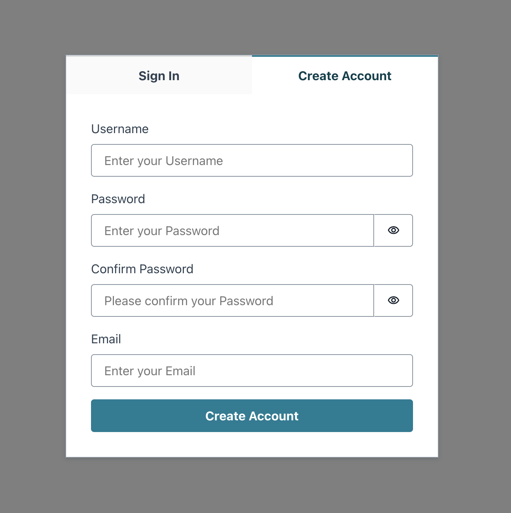

Switch to “Create Account” tab and enter the values in the fields, provide the real email address as a verification code will be sent to the email address.

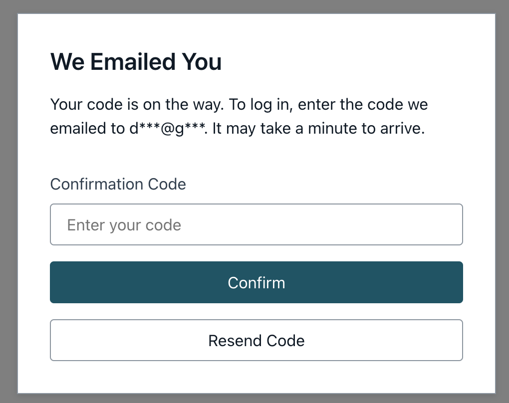

>

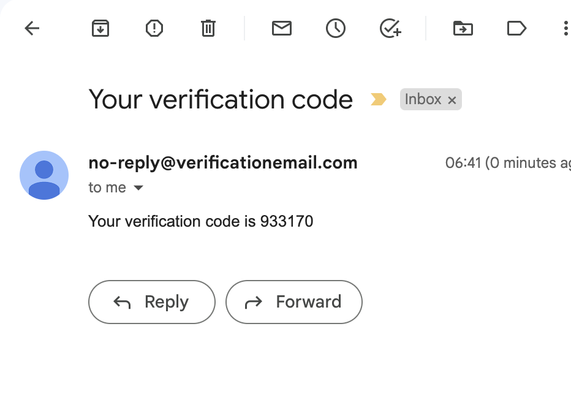

Upon confirmation, the home page will be shown with username and signOut buttons. Try Sign out and Sign options.

#### Add Bootstrap

[Bootstrap](https://www.bootstrapcdn.com/) is a free and open-source CSS framework directed at responsive, mobile-first front-end web development. It contains HTML, CSS and JavaScript-based design templates for typography, forms, buttons, navigation, and other interface components

    npm install bootstrap jquery react-toastify

Open `index.js` file and import css, jqery and bootstrap js files.

    import 'bootstrap/dist/css/bootstrap.min.css'
    import 'jquery/dist/jquery.min.js'
    import 'bootstrap/dist/js/bootstrap.min.js'

Now, open the `App.js` and apply the bootstrap classes. Refer the below code. `className` attributes.

    import { withAuthenticator } from "@aws-amplify/ui-react"
    import React from "react"
    import "@aws-amplify/ui-react/styles.css"

    function App({ user, signOut }) {
        return (
            <div className="container">
                <h1>{user.username}</h1>
                <button onClick={signOut} className="btn btn-primary">
                    Sign Out
                </button>
            </div>
        )
    }
    export default withAuthenticator(App)

Now, you should see a "Sign Out" button in blue color.

#### Create a GraphQL API and database

Run the below command to add the API, and select the options as shown below:

    amplify add api

Select the defaults for the following prompts:

    ? Select from one of the below mentioned services:
      GraphQL
    ? Here is the GraphQL API that we will create. Select a setting to edit or continue
      Continue
    ? Choose a schema template:
      Single object with fields (e.g., “Todo” with ID, name, description)

Update the code and push the changes to remote to update the services /queries / schemas:
`/aws-amplify-faqs/amplify/backend/api/awsamplifyfaqs/schema.graphql`

    type FAQ @model {
        id: ID!
        question: String!
        answer: String!
    }

Next, run the following command to check Amplify's status:

    amplify status

This will give us the current status of the Amplify project, including the current environment, any categories that have been created, and what state those categories are in. It should look similar to this:

```
Current Environment: dev
|-------------|------------------------|-----------|--------------------|
| Category    | Resource Name          | Operation | Provider Plugin    |
|-------------|------------------------|-----------|--------------------|
| Api         | awsamplifyfaqs         | Create    | awscloudformation  |
| Auth        | awsamplifyfaqsbd8d0f79 | No Change | awscloudformation  |
|-------------|------------------------|-----------|--------------------|
```

Next: push the changes to the cloud.

    amplify push

Accept the below configuration options:

```
Current Environment: dev
|-------------|------------------------|-----------|--------------------|
| Category    | Resource Name          | Operation | Provider Plugin    |
|-------------|------------------------|-----------|--------------------|
| Api         | awsamplifyfaqs         | Create    | awscloudformation  |
| Auth        | awsamplifyfaqsbd8d0f79 | No Change | awscloudformation  |
|-------------|------------------------|-----------|--------------------|
GraphQL schema compiled successfully.

? Do you want to generate code for your newly created GraphQL API
  Yes
? Choose the code generation language target
  javascript
? Enter the file name pattern of graphql queries, mutations and subscriptions
  src/graphql/**/*.js
? Do you want to generate/update all possible GraphQL operations - queries, mutations and subscriptions
  Yes
? Enter maximum statement depth [increase from default if your schema is deeply nested]
  2
```

You may navigate to [AWS AppSync console](https://aws.amazon.com/appsync/) and perform some queries, mutations. Also, check the tables which were created in [Amazon DynamoDB](https://aws.amazon.com/dynamodb/).

#### Create React Components:

Create the `components` folder under `src` folder. And, create / copy below listed components under `src/components` folder. Refer the code available at [aws-amplify-faqs/src/components](aws-amplify-faqs/src/components) components/[file].jsx.

- AddFaq.jsx
- addFaq.jsx
- addFaqBtn.jsx
- header.jsx
- header.jsx
- noResultsFound.jsx
- search.jsx
- spinner.jsx

Update the `App.js` file too from code [App.js](aws-amplify-faqs/src/App.js)

#### Connect API

Create an index.js file under `services' repo and copy the code from [index.js](aws-amplify-faqs/src/services/index.js)

Start the server (if stopped) from the root directory by running below command.

    npm start

Now, go to the http://localhost:3000 and check the output. You may try resizing the browser to test the responsive design.


#### Add hosting to your app

Add the hosting resources to the backend. Upon completion, the CloudFormation template for the resources is placed in the amplify/backend/hosting directory

    amplify add hosting

Select the `Amazon CloudFront and S3` for the prompt:

    ? Select the plugin module to execute …  (Use arrow keys or type to filter)
    ✔ Select the plugin module to execute · Amazon CloudFront and S3
    ✔ hosting bucket name · awsamplifyfaqs-20230823172138-hostingbucket

Next:
The `amplify publish` command is designed to build and publish both the backend and the frontend of the project.

    amplify publish

>

    Publish started for S3AndCloudFront
    ✔ Uploaded files successfully.

    Your app is published successfully.
    https://d242k0vxfukqos.cloudfront.net

---

<div align="center">
#### Congratulations, the app is online @ https://d242k0vxfukqos.cloudfront.net

---

<div align="left">

Filter the questions on the client-side by entering the keywords in filter input textbox

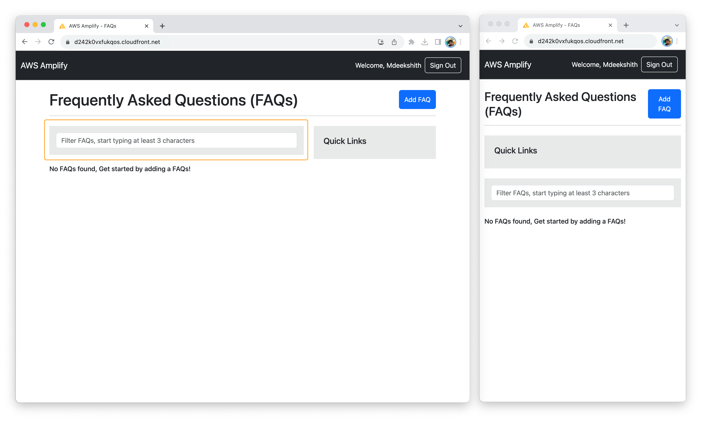

No matching questions found!
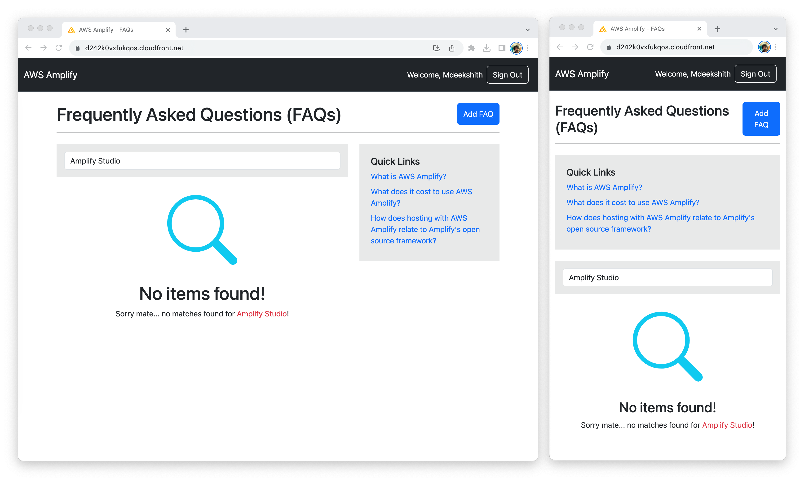

Enter the question, answer in the form fields and select Add FAQ to save the data


The newly added question and answer is added to the list and highlighted in green color. Note that, the Quick Links list also updated.
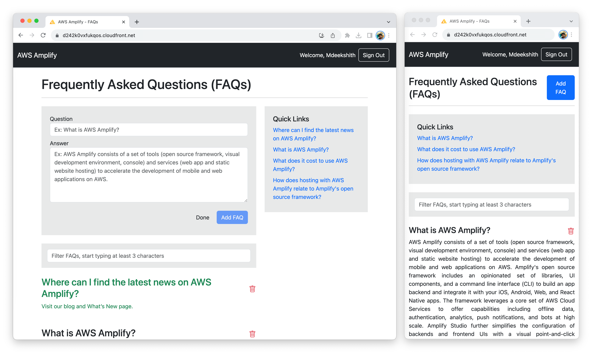

On load / page refresh, the list is sort based on the date which the question and answers were added.
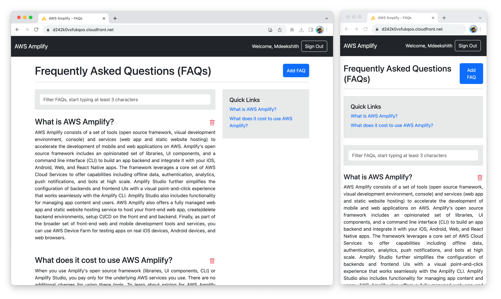

Select Delete icon to delete the question and answer.
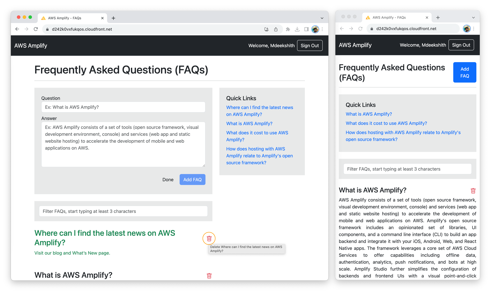

A toaster is shown, indicating the status of deleted record.
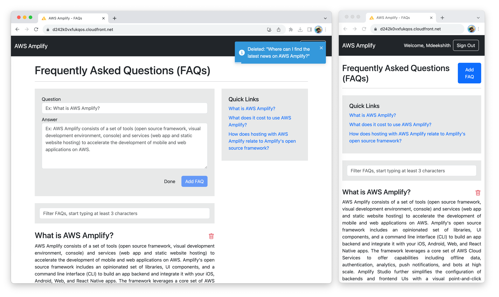

#### Clean-up

To delete all the environments of the project from the cloud and wipe out all the local files created by Amplify CLI, run amplify delete command.

    amplify delete

✔ Project deleted in the cloud.
✅ Project deleted locally.

<div align="center">

Previous: [< Prerequisites](prerequisites.md)
