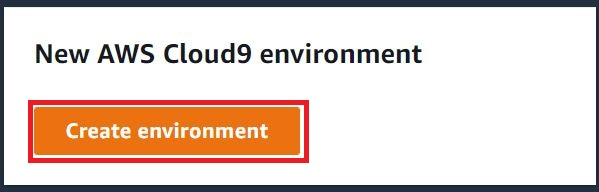
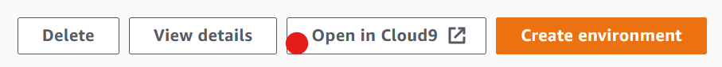
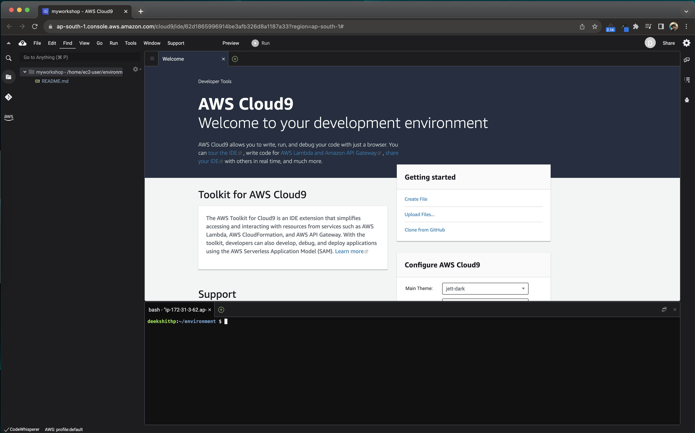
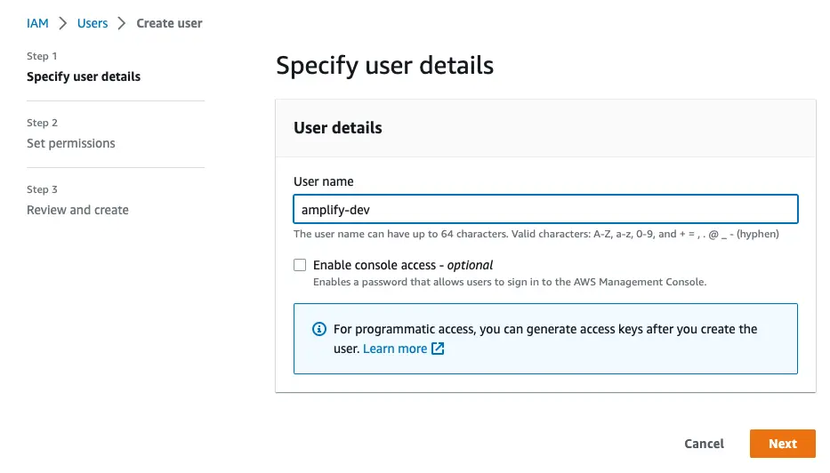
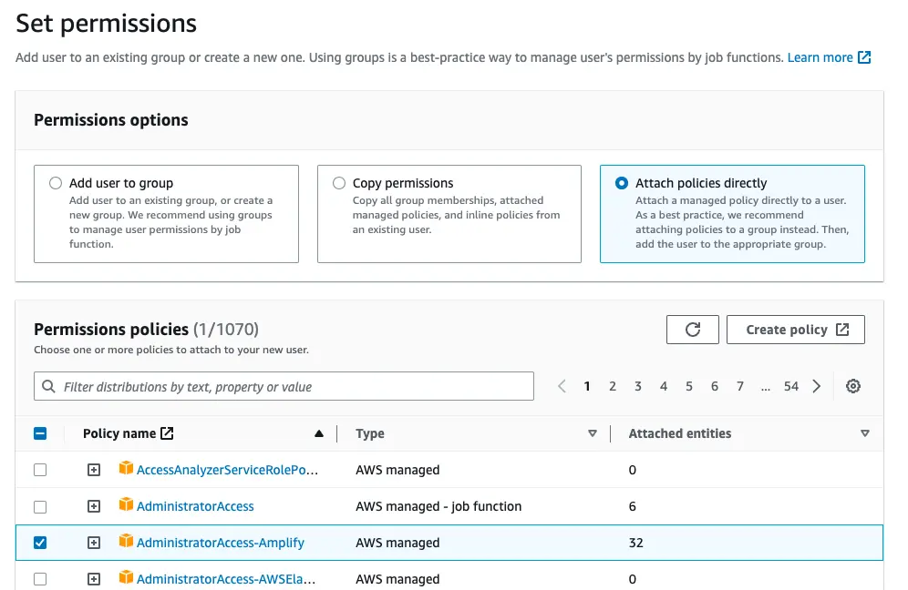
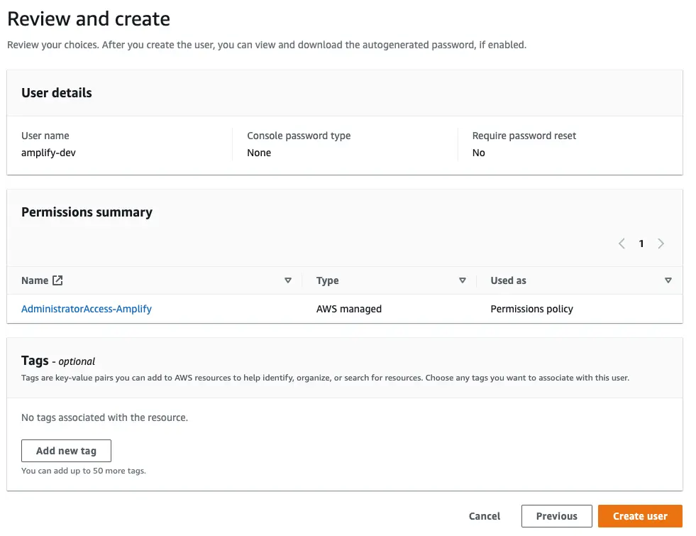
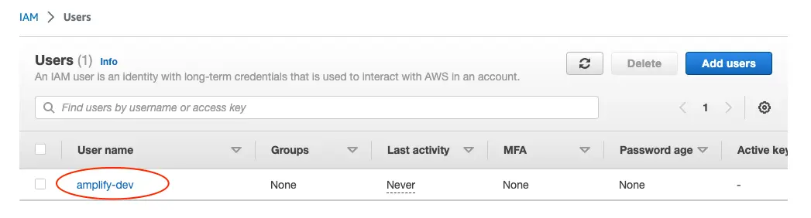
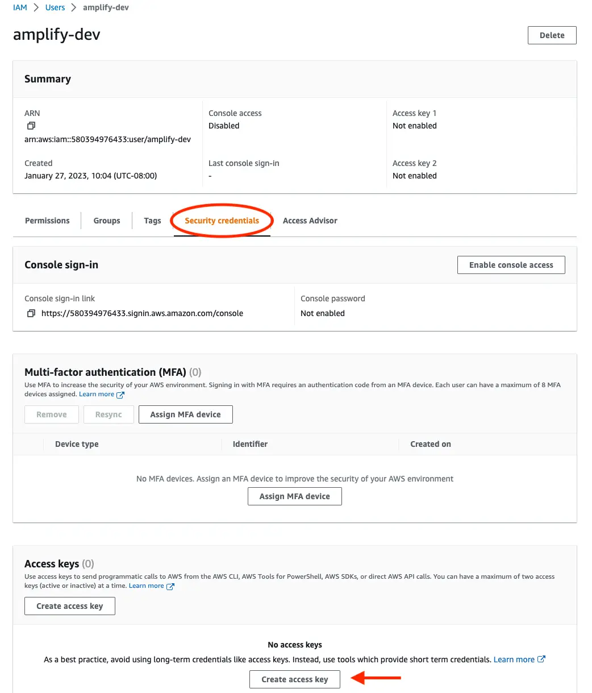
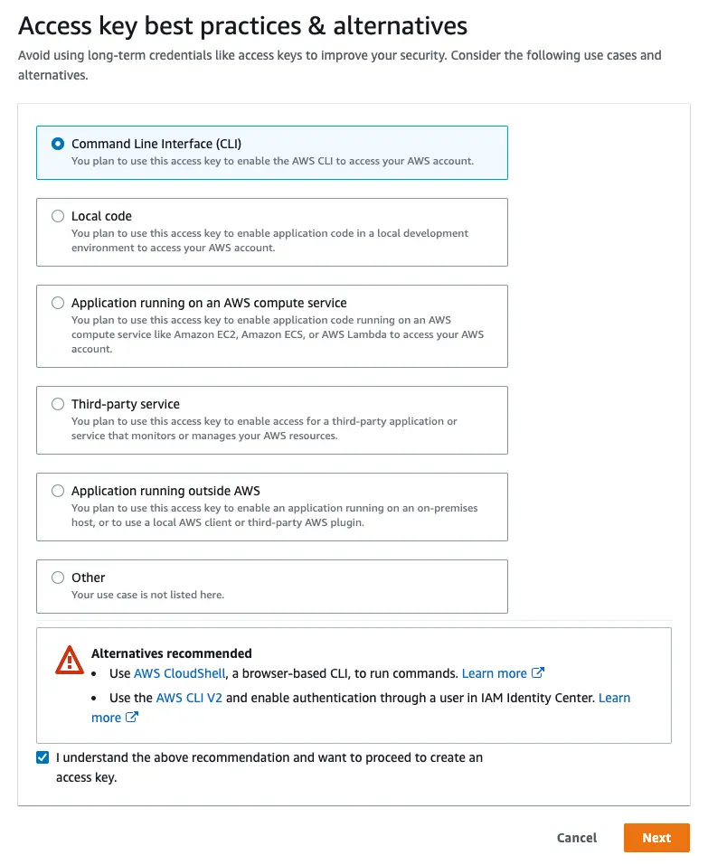
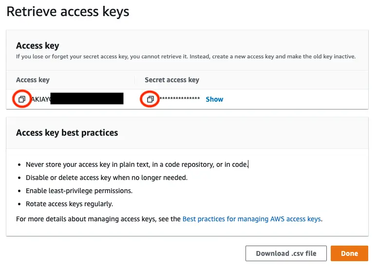

## Prerequisites

#### Sign up for an AWS account

If you don't already have an AWS account, you'll need to create one in order to follow the steps outlined in this tutorial.

- Amazon employees can use their [isengard](https://isengard.amazon.com/) account
- [Create AWS account](https://portal.aws.amazon.com/billing/signup?redirect_url=https%3A%2F%2Faws.amazon.com%2Fregistration-confirmation#/start/email)

#### Set up AWS Cloud9 IDE

Set up an AWS Cloud9 development environment and then use the AWS Cloud9 IDE to code, run, and debug your application.

1.  After you sign in to the AWS console, navigate to the [AWS Cloud9 console](https://us-east-1.console.aws.amazon.com/cloud9control/home), in the top navigation bar choose an AWS Region to create the environment in.
2.  Choose the Create environment button in one of the locations shown. If you don't already have AWS Cloud9 environments, the button is shown on a welcome page.

    

3.  If you already have AWS Cloud9 environments, the button is shown as follows.

    

4.  On the **Create environment page**, for **Name**, enter a name for your environment, for instance, **amplify-workshop**.
5.  For ""Description"", enter something about your environment.
6.  For **Environment type**, choose **New EC2** instance to create an Amazon EC2 environment
7.  On the New EC2 instance panel for Instance type, keep the **t3.small (2 GiB RAM + 2 vCPU)**
8.  For Platform, choose the type of Amazon EC2 instance: Amazon Linux 2
9.  Leave other default options as it is
10. Choose **Create** to create your environment, and then you're redirected to the home page. If the account is successfully created, a green flash bar appears at the top of the AWS Cloud9 console. You can select the new environment and choose **Open in Cloud9** to launch the IDE.

    

If the account fails to create, a red flash bar appears at the top of the AWS Cloud9 console. Your account might fail to create because of a problem with your web browser, your AWS access permissions, the instance, or the associated network. You can find information about possible fixes in the [AWS Cloud9 Troubleshooting section](https://docs.aws.amazon.com/cloud9/latest/user-guide/troubleshooting.html#troubleshooting-env-loading).

#### Install the packages

The Cloud9 IDE comes with preinstalled tools, however, make sure you have the following packages, runtime environments installed on on AWS Cloud9 development environment.

In Cloud9 IDE console, run the `sudo yum list installed` command to list all preinstalled packages.

- [node.js](https://nodejs.org/en)
- [npm](https://www.npmjs.com/)
- [git](https://git-scm.com/)

Alternatively, you run the below commands to check whether the tools are installed or not. If you see the version, that means the packages were already installed.

    $ node --version
    output > v16.20.2

    $ npm --version
    output > 8.19.4

    $ git --version
    output > git version 2.40.1

#### Install the Amplify CLI and Configure

The Amplify Command Line Interface (CLI) is a unified toolchain to create AWS cloud services for your app. Let's go ahead and install the Amplify CLI.

    npm install -g @aws-amplify/cli

Run the below command to install xdg-utils. xdg-utils is a set of tools that allows applications to easily integrate with the desktop environment of the user, regardless of the specific desktop environment that the user runs.

    sudo yum -y install xdg-utils

Configure Amplify by running the following command:

    amplify configure

`amplify configure` will ask you to sign into the AWS Console.

Once you're signed in, Amplify CLI will ask you to create an IAM user.

    Follow these steps to set up access to your AWS account:

    Sign in to your AWS administrator account:
    https://console.aws.amazon.com/
    Press Enter to continue

    Specify the AWS Region
    ? region:  us-east-1

Follow the instructions provided at [Create IAM user and access keys](#create-iam-user-and-access-key) section (below) to complete the user creation in the AWS console

    https://console.aws.amazon.com/iamv2/home#/users/create
    Press Enter to continue
    create
    Enter the access key of the newly created user:
    ? accessKeyId:  ********************
    ? secretAccessKey:  ****************************************
    This would update/create the AWS Profile in your local machine
    ? Profile Name:  default

    Successfully set up the new user.

---

##### Create IAM user and access keys

- create-iam-user-and-access-key
- Navigate to the [IAM User creation page](https://console.aws.amazon.com/iamv2/home#/users/create) if it's not already open.

- Enter a User name, check the **Provide user access to the AWS Management Console - optional** checkbox and select Next. You can name the user anything but we'll call it "amplify-dev".
  
- Select **Attach policies directly** and select **AdministratorAccess-Amplify** as the Permissions policy. Select Next.
  
- On the Review page, check that everything looks good and select Create user.
  
- This will redirect to the users list page. Select the user you just created.
  
- On the user details page, navigate to the **Security credentials** tab, scroll down to **Access keys** and select **Create access keys**.
  
- On the next page, select Command Line Interface, acknowledge the warning, and select Next.
  
- On the next page select Create access key. You’ll then see a page with the access keys for the user. Use the copy icon to copy these values to your clipboard, then return to the Amplify CLI.
  

- Enter the values you just copied into the corresponding CLI prompts

      Enter the access key of the newly created user:
      ? accessKeyId:  # YOUR_ACCESS_KEY_ID
      ? secretAccessKey:  # YOUR_SECRET_ACCESS_KEY

      This would update/create the AWS Profile in your local machine
      ? Profile Name:  # (default)

      Successfully set up the new user.

---

Previous: [< About workshop](README.md) | Next: [Set up full stack project >](full-stack-project.md)
